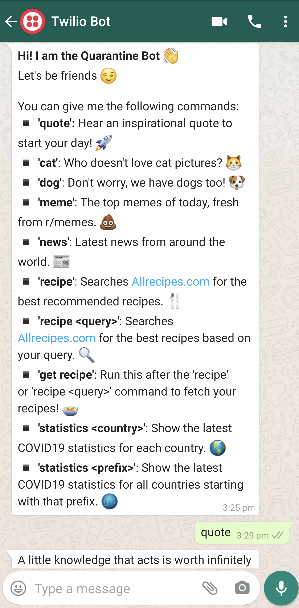
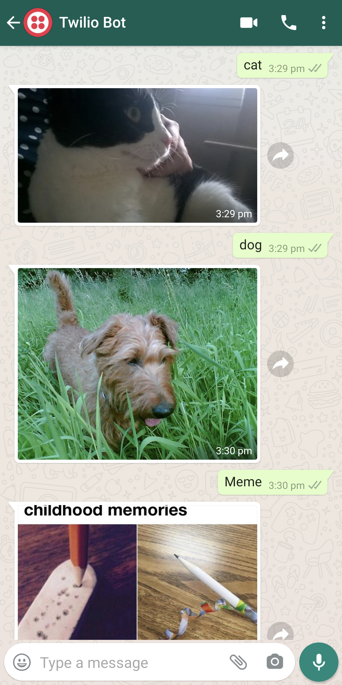
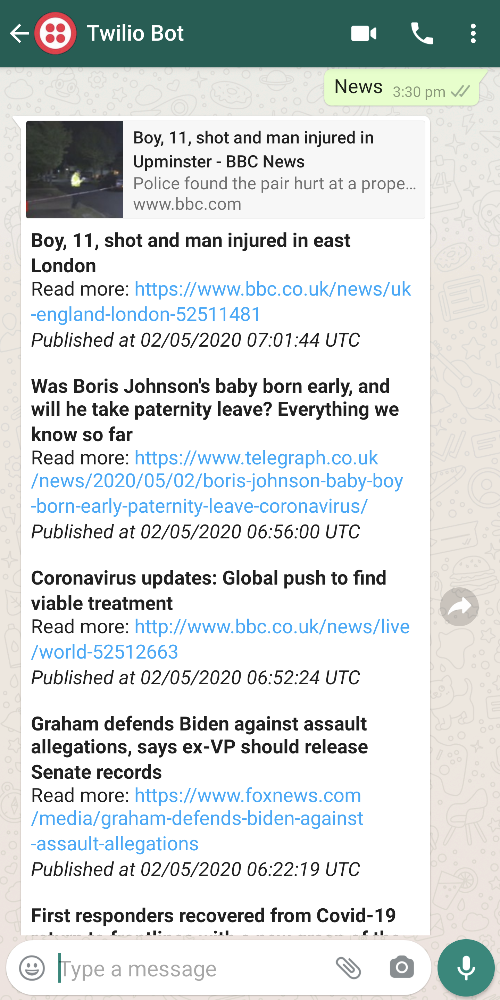
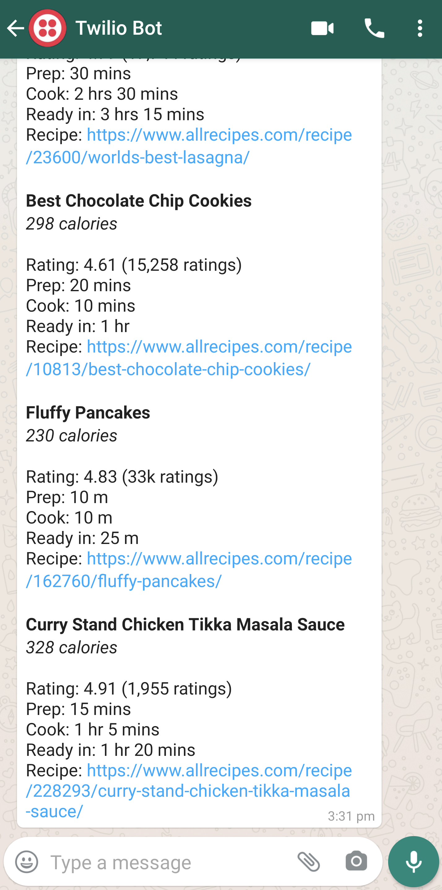
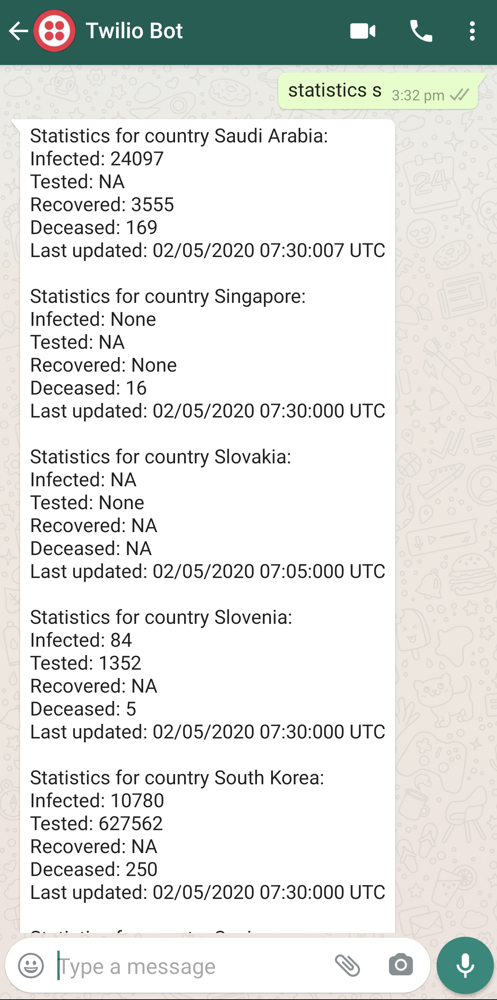

# Quarantine Bot
WhatsApp bot powered by Twilio API to get through the quarantine. Latest COVID19 statistics, world news, inspirational quotes and cat photos.

## Building Your Own Bot
Read my tutorial [here](https://dev.to/zeyu2001/i-built-a-python-whatsapp-bot-to-keep-me-sane-during-quarantine-nph)!

## How to Deploy
1. Clone this repository and deploy it on any Django-friendly hosting service like [PythonAnywhere](https://pythonanywhere.com). Use `$ pip install -r requirements.txt` to install the program dependencies.
2. Create a free Twilio account and setup the WhatsApp sandbox [here](https://www.twilio.com/console/sms/whatsapp/sandbox)
3. Under Sandbox Configuration, set the webhook for 'WHEN A MESSAGE COMES IN' to e.g. http://zeyu2001.pythonanywhere.com/bot/
depending on where you host the webhook. Remember the relative url bot/. Set the request method to HTTP POST.
4. Click save, and send 'hello' to the Twilio bot!

## What You Can Do
Simply type 'Hello' for a list of commands you can use.

